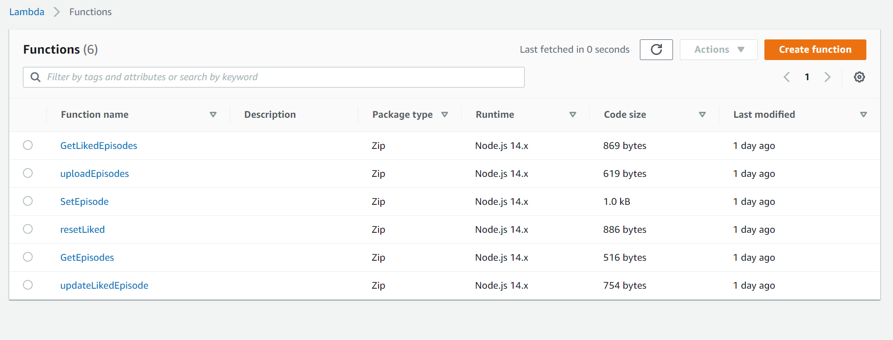
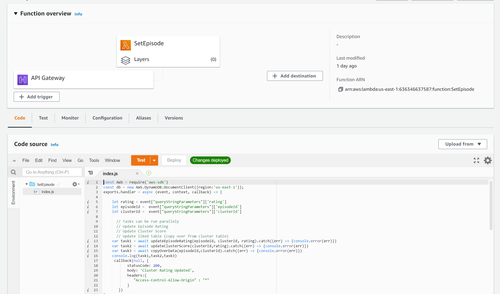
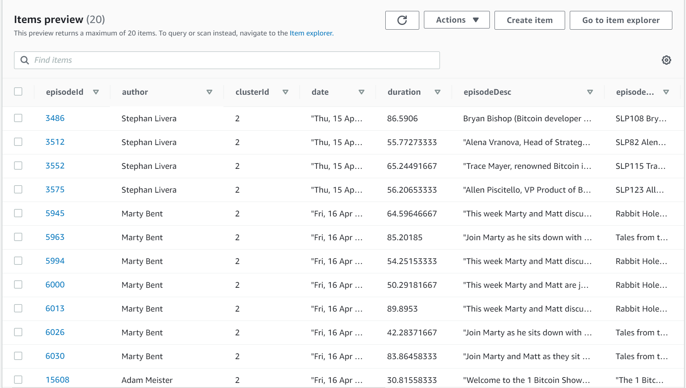
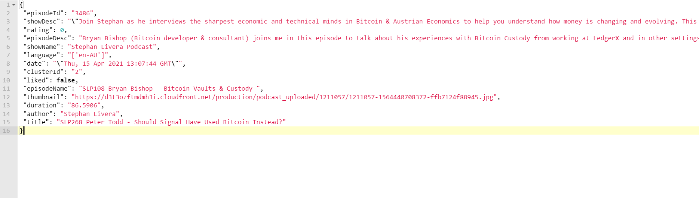

# Podcast visualization website Backend in AWS

## AWS Introduction

Ensure to create all the AWS resources below in the same datacenter region to have less latency and cross datacenter calls. We have used us-east-1 region.

Head over to [https://console.aws.amazon.com/console/home?region=us-east-1](https://console.aws.amazon.com/console/home?region=us-east-1) and use this landing page search bar to reach any of the following services discussed below.

## AWS API Gateway

The REST endpoints which enable to connect the frontend webpage hosted on github pages to the backend server and database is the API gateway. It also defines the interface and protocol between the front end and backend.

The following is the API gateway endpoints. We have 4 resources

1. /episode – for uploading episodes, and obtaining episodes in a cluster
2. /liked – to like an episode, or retrieve list of liked episodes
3. /reset – to reset the database for new user
4. /uploadepisode – helper endpoint to populate podcast database

Each of these endpoints is connected to a AWS lambda function, these functions are triggered whenever the rest endpoint is invoked from the frontend.

## AWS Lambda

The serverless backend is advantageous to use to scale up services and quickly iterate to produce cutting-edge backend services.

Use the top right, create function button to add new functions. We have defined the following 6 functions, which map to the REST endpoints described earlier. This can be easily replicated by creating lambda functions with the code submitted in the deliverables. The backend code is in node.js.

Note: Ensure to create a AWS role that is able to write/read from AWS DynamoDB and use that same role for all the functions.

Below is an example of sample function: SetEpisode, which reads data from REST query parameters and make the necessary database calls.

To make the calls efficient and reduce latency, asynchronous programming techniques were used. Implemented as promises in node.js

# AWS DynamoDB

DynamoDB is No-SQL database that is used to store episode data across clusters.

Creating a database is straightforward, once clustering is done, we groupby clusterId and upload episodes in clusterId to the databases. We follow the schema below:

Since dynamodb does not support direct uploading of csv files, we had to build a custom uploader function that parses .csv returned from clustering method and uploads the items to the database. You can utilize the uploadEpisode function in javascript, specify the clusterId to parse from csv file and upload items to database.

Note: Ensure the table exists in DynamoDB before running helper function to upload scripts, otherwise it would result in errors. Chrome browser developer console can be used to monitor if all items have been uploaded correctly, when server returns 200 response.
